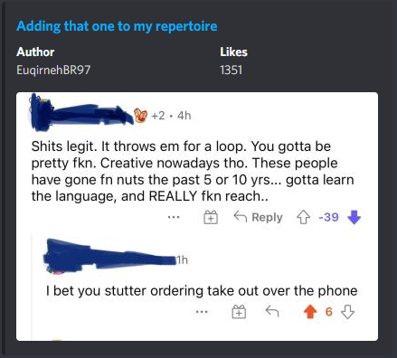

## A simple Discord Bot for r/rareinsults written in Go

The aim was to get posts from `r/rareinsults` and display them in Discord.
Currently this gets the top 500 newest posts and is triggered by entering `!r`.   

### 🚀 Quick start
1. Clone Repo
2. Rename the `.envtemplate` to `.env`
3. Add in your Discord Token
4. Run the bot!
Navigate into the directory and run it.
```
cd rareinsults-discord-bot/
go run .
```

### Heroku 
Don't want to run it locally, Deploy it now with Heroku!
[](https://heroku.com/deploy?template=https://github.com/JacksDevPlayground/rareinsults-discord-bot)


### Dependencies 
- [Discordgo](https://github.com/bwmarrin/discordgo)
- [Godotenv](https://github.com/joho/godotenv)
- [Go-Reddit](https://github.com/vartanbeno/go-reddit/)

### Screenshots


<br />
**Figure: The embed post sent to Discord**